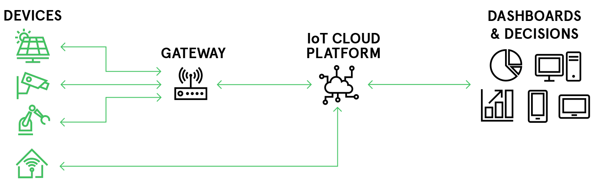
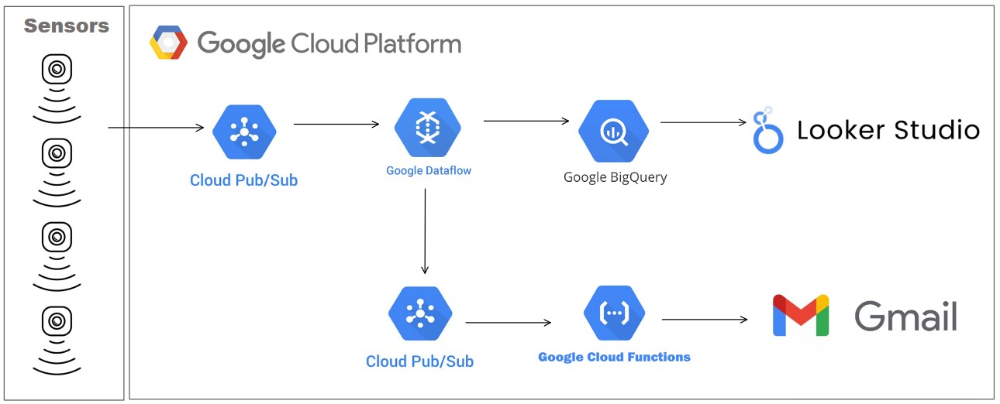

# IoT Serverless real-time architecture
Data Project 2 | EDEM 2022/2023 | Group 3 

*Sara Adam, María García, Franzi Kröger, Javi Riaza, Fan Wu*

## Introduction
### Case Description
**DEXTROSA S.A** is a provider producing sugar. One of its many challenges is identifying failures in the production as soon as possible in order to reduce the time-out of their machines. To achieve this challenge, they have launched with IoT sensors  equipped machines to monitor the **temperature**,  **absolute pressure** and its **motor power** in order to regulate the optimal conditions for the production.

### Business Challenge
- You must think of an IoT product, develop it, simulate its use and present it as SaaS.
- The solution must be scalable, open source and cloud.



## Data Architecture & Setup 
### Data Architecture


### Google Cloud Platform (GCP)
- [Google Cloud Platform - Free trial](https://console.cloud.google.com/freetrial)
- Clone this **repo**
- For this Demo, we will be working on a **Cloud Shell**.

### GCP Components being used in this project
- **Pub/Sub:** A messaging service that allows applications to send and receive messages between independent components. It's a scalable, reliable, and fast service that can handle data from any source in real-time.

- **Dataflow:** A fully-managed, serverless data processing service that can handle both batch and stream processing workloads. It allows you to create data pipelines that can read, transform, and write large volumes of data from various sources.

- **BigQuery:** A serverless, highly-scalable cloud data warehouse that enables interactive analysis of large datasets. It allows you to store and analyze structured and semi-structured data using SQL-like queries.

- **Cloud Functions:** A serverless platform that allows you to write and run event-driven functions that can be triggered by various Google Cloud events. It provides an easy way to build and deploy small pieces of code that can run on demand.

- **Cloud Storage:** A highly-scalable, fully-managed object storage service that allows you to store and retrieve data from anywhere, at any time. It offers a secure, durable, and highly available environment for storing any type of data, including structured and unstructured data. 

- **Looker Studio:** A business intelligence and data visualization platform that allows you to connect to various data sources, transform and clean data, and build reports and dashboards. It provides a collaborative environment for business users to analyze data and make informed decisions.


## Steps to Do in Google Cloud Platform (GCP)
### 1. Create a Google Cloud Project & install Setup Requirements
- Create a new *Google Cloud Project*: Go to the Cloud Console [Resource Manager](https://console.cloud.google.com/cloud-resource-manager) page. Click **Create Project** and provide a unique project name and id. Only use numbers and lower case letters, otherwise there'll arise some problems when creating the docker image for Dataflow.

- Now it's time to activate your Cloud Shell. If your *Cloud Platform Project* in this session is set to a different, previously used project, change it to your new one:
```
gcloud config set project <PROJECT_ID>
```

- Enable required *Google Cloud APIs*:
```
gcloud services enable dataflow.googleapis.com
gcloud services enable cloudbuild.googleapis.com
gcloud services enable cloudfunctions.googleapis.com
```

- Create *Python environment*:
```
virtualenv -p python3 <ENVIRONTMENT_NAME>

source <ENVIRONMENT_NAME>/bin/activate
```

- Install *Python dependencies*:
```
pip3 install -U -r setup_dependencies.txt

pip3 install apache-beam[gcp]
```

### 2. Create Topics with PubSub
First of all, we will create two **Topics** and their default **Subscriptions** (for example: *mytopic* & *mytopic-sub*).

- Go to the Cloud Console [PubSub](https://console.cloud.google.com/cloudpubsub) page. Click **Create Topic**, provide a unique topic name and make sure that the **add default subscription** option is selected. 

- Creating a topic and its subscription can also be performed via the terminal with the following command:
```
gcloud pubsub topics create <TOPIC_NAME> --project <PROJECT_ID>

gcloud pubsub subscriptions create <SUBSCRIPTION_NAME> --topic <TOPIC_NAME> <PROJECT_ID>
```

### 3. Create a storage bucket with Cloud Storage
In order to store the Dataflow Flex template, a bucket needs to be created. 
- Go to the Cloud Console [Cloud Storage](https://console.cloud.google.com/storage) page. Create a **bucket** specifying a global unique name, selecting EU (multiple regions) as location and leaving the other settings as default.
- Creating a bucket can also be performed via the terminal:

```
gcloud storage buckets create gs://<BUCKET_NAME> \
--project <PROJECT_ID> \
--location=eu \
--uniform-bucket-level-access
```

### 4. Create a dataset with BigQuery
The sensor-data will be saved in a table in BigQuery. For that we need to create a dataset.

- Go to the Cloud Console [BigQuery](https://console.cloud.google.com/bigquery) page. Create a **BigQuery Dataset** by specifying EU as data location. 
- Alternatively, use the following command:
```
bq mk --location EU <PROJECT_ID>:<DATASET_NAME>
```

### 5. Create a pipeline with Dataflow
With Dataflow a **pipeline** that has been defined in a *Python Script* will be created with which the data will be transformed/ processed. Here are two ways how to set-it up: 
- Run Pipeline in **GCP Cloud Shell**:
```
python3 dataflow.py \
    --project_id <PROJECT_ID> \
    --input_subscription <INPUT_TOPIC-SUBSCRIPTION> \
    --output_topic <OUTPUT_TOPIC> \
    --output_bigquery <DATASET_NAME>.<TABLE_NAME> \
    --runner DataflowRunner \
    --job_name dataflow-job \
    --region europe-west1 \
    --temp_location gs://<BUCKET_NAME>/tmp \
    --staging_location gs://<BUCKET_NAME>/stg
```

- Alternatively, a **Dataflow Flex Template** can be created ([click here for more info)](https://cloud.google.com/dataflow/docs/guides/templates/using-flex-templates). 

Firstly, [package your python code into a Docker image](https://cloud.google.com/dataflow/docs/guides/templates/using-flex-templates#python_only_creating_and_building_a_container_image) and store it in Container Registry:
```
gcloud builds submit --tag 'gcr.io/<PROJECT_ID>/<FOLDER_NAME>/<IMAGE_NAME>:latest' .
```
Then, [create a Dataflow Flex Template](https://cloud.google.com/dataflow/docs/guides/templates/using-flex-templates#creating_a_flex_template) from your Docker image:
```
gcloud dataflow flex-template build "gs://<BUCKET_NAME>/<TEMPLATE_NAME>.json" \
    --image "gcr.io/<PROJECT_ID>/<FOLDER_NAME>/<IMAGE_NAME>:latest" \
    --sdk-language "PYTHON" \
    --metadata-file "schemas/metadata.json"
```

Finally, run a [Dataflow job from template](https://cloud.google.com/dataflow/docs/guides/templates/using-flex-templates#running_a_flex_template_pipeline):

```
gcloud dataflow flex-template run "<DATAFLOW_JOB_NAME>" \
    --template-file-gcs-location "gs://<BUCKET_NAME>/TEMPLATE_NAME>.json" \
    --parameters project_id="<PROJECT_ID>" \
    --parameters input_subscription="<INPUT_PUBSUB_SUBSCRIPTION>" \
    --parameters output_topic="<OUTPUT_PUBSUB_TOPIC>" \
    --parameters output_bigquery="<DATASET>.<TABLE>" \
    --region "europe-west1" 
```

### 7. Create the script to send emails with Cloud Function
In case a machine is not working properly and the measured data is out of their optimum ranges, an email will be sent to the people indicated in a *Python Script*. 

- Go to CloudFunctions folder and follow the instructions placed in edemCloudFunctions.py file.
- Go to Cloud Console [Cloud Functions](https://console.cloud.google.com/functions) page.
- Click **Create Function** (europe-west1) and choose **PubSub** as trigger type and click **save**.
- Click **Next** and choose **Python 3.9** as runtime.
- Copy your code into Main.py file and python dependencies into requirements.txt.
- When finished, click **deploy**.
- If an aggregate temperature by minute is out-of-range, **a command will be thrown to the device and its config will be updated**. You can check that by going to *config and state* tab in IoT device page.

### 8. Run Data Generator/Publisher
The **Generator/Publisher** that has been defined in a *Python Script* will simulate the data from our IoT machine sensors. It then inserts the data into a Pub/Sub Topic.
- Run Data Generator/Publisher in **GCP Cloud Shell**:
```
python3 generator_publisher.py \
--project_id <PROJECT_ID> \
--topic_name <INPUT_TOPIC>
```
- Alternatively, the Python Script can be **dockerized** in order to simulate multiple Sensora at once.

To be able to lift the docker containing our image that simulates the sensor's streaming data, the following steps must be followed:

**A.Build the docker image**
- Make sure we are in the correct path, 01_Publishing/generator.
- Once inside the correct folder we launch the command through the sheel to be able to lift the image described in the Dockerfile. Where the <IMAGE_NAME> will be replaced by the name we want to give to the image:

```
docker build -t <image_name> .
```

**B.Run the container**
- After building the image we are going to raise the container so that it can start generating data to simulate our sensor.
- The <PROJECT_ID> will be replaced by the ID of our project in GCP and the <TOPIC_NAME> by the topic we want to connect to our data generator.

```
docker run -e --project_id=<project_id> -e --topic_id=<TOPIC_NAME> <IMAGE_NAME> \
python generator_publisher.py \
--project_id=<PROJECT_ID> \
--topic_name=<TOPIC_NAME>
```

**C.Dockerize to simulate many sensors**
- With the help of the cd command ... navigate back to the 01_Publishing folder where there is a python script with the code to automatically raise and remove docker containers.
- <TOPCONTAINERS> will be the maximum number of containers we want to have running at once, <ELAPSEDTIME> seconds to send the container data and <<IMAGENAME> is the docker image that has been created in the previous step.

```
pip install -U -r requirements.txt
```

```
python main.py -t <TOPCONTAINERS> -e <ELAPSEDTIME> -i <IMAGENAME>
```

By now, the data from the machine should be published in GCP and be filled in the table in BigQuery. 

### 9. Visualize data from BigQuery with Looker Studio
- Go to [**Looker Studio**](https://lookerstudio.google.com/u/0/). Link your BigQuery table.
- Create a Dashboard as shown below, which represents temperature and pressure and the motor power of the machine.

## Video
- [DATA PROJECT 2 GROUP 3](INSERT VIDEO LINK)
